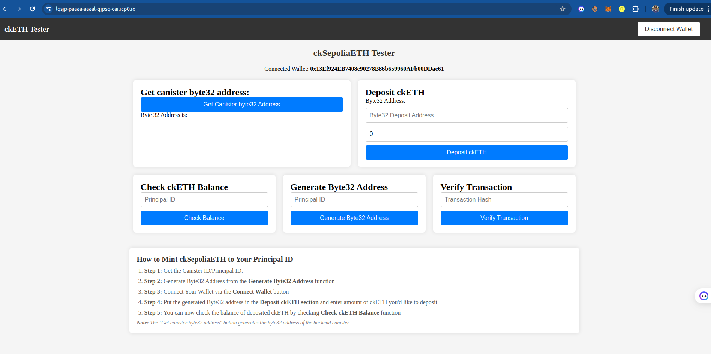

# Getting Started with ckETH: A Step-by-Step Guide

This tutorial will guide you through the process of working with ckETH, from generating a subaccount for ETH deposits to minting ckETH and verifying transactions on-chain. By the end of this tutorial, you will have a basic understanding of how to interact with the ckETH protocol using a Rust backend and a React frontend.

Slides on ckETH explanation can be found [here](https://www.canva.com/design/DAGNHEG_n-Y/Z8vo3oZsTnxMINLBlyizYw/edit)

## ckTokens Minter: 
You can now easily mint ckSepoliaETH to your principal ID using this site - [Link](https://lqsjp-paaaa-aaaal-qjpsq-cai.icp0.io/) 



```bash
Here are the steps: 

Step 1: Get the Canister ID/Principal ID.
Step 2: Generate Byte32 Address from the Generate Byte32 Address function
Step 3: Connect Your Wallet via the Connect Wallet button
Step 4: Put the generated Byte32 address in the Deposit ckETH section and enter amount of ckETH youd like to deposit
Step 5: You can now check the balance of deposited ckETH by checking Check ckETH Balance function
Note: The "Get canister byte32 address" button generates the byte32 address of the backend canister.
```

## Prerequisites

Before we begin, ensure you have the following:

- You've installed [necessary environment requirements](https://internetcomputer.org/docs/current/developer-docs/getting-started/install/)
- [MetaMask installed in your browser](https://metamask.io/download/) with [Sepolia ETH (testnet) tokens](https://www.alchemy.com/faucets/ethereum-sepolia)
- Basic knowledge oF rust

## Step 0(b): Understanding the frontend logic
The frontend logic for ``ckSepoliaETH`` is located in the 
```
_src
    ...
    | 
    |_cketh_tutorial_frontend
      |_components 
        |_Header
          ...
          |_ckSepoliaETH
          ...
```

## 1. ckSepoliaCanisterIDs

### Description
This function retrieves the Ledger and Minter canister IDs for ckSepoliaETH from the backend canister on the Internet Computer.

### Usage
- **Purpose**: Fetches and sets the Ledger and Minter canister IDs for ckSepoliaETH.
- **Called When**: Automatically called when the component is mounted.

### Code Example
```javascript
const ckSepoliaCanisterIDs = async () => {
  const ledgerCanisterID = await cketh_tutorial_backend.ck_sepolia_eth_ledger_canister_id();
  setkSepoliaETHLedgerid(ledgerCanisterID);

  const minterCanisterID = await cketh_tutorial_backend.ck_sepolia_eth_minter_canister_id();
  setkSepoliaETHMinterid(minterCanisterID);
};
```

### Key Points
- **Async Operation**: Retrieves canister IDs asynchronously.
- **State Management**: Updates `ckSepoliaETHLedgerid` and `ckSepoliaETHMinterid` states.

---

## 2. depositAddress

### Description
Fetches a unique deposit address from the backend canister on the Internet Computer, used for Ethereum deposits.

### Usage
- **Purpose**: Retrieves and sets the deposit address in the `canisterDepositAddress` state.
- **Called When**: Automatically called when the component is mounted.

### Code Example
```javascript
const depositAddress = async () => {
  const depositAddress = await cketh_tutorial_backend.canister_deposit_principal();
  console.log("Deposit address: ", depositAddress);
  setCanisterDepositAddress(depositAddress);
};
```

### Key Points
- **Async Operation**: Ensures that the deposit address is retrieved before updating the state.
- **State Update**: Updates the `canisterDepositAddress` state.

---

## 3. depositckETH

### Description
Interacts with the MinterHelper smart contract on Ethereum to deposit the specified amount of Ethereum to the deposit address.

### Usage
- **Purpose**: Executes the deposit transaction and stores the transaction hash.
- **Called When**: The user clicks the "Deposit ckSepoliaETH" button.

### Code Example
```javascript
const depositckETH = async () => {
    if (!walletConnected) {
      toast.error("Wallet not connected");
      return;
    }

    setIsDepositLoading(true);
    try {
      const provider = new ethers.providers.Web3Provider(window.ethereum);
      const signer = provider.getSigner();
      const contract = new ethers.Contract(MinterHelper.SepoliaETHMinterHelper, abi, signer);

      const tx = await contract.deposit(canisterDepositAddress, {
        value: ethers.utils.parseEther(amount.toString())
      });

      toast.info("Sending ETH to the helper contract");
      await tx.wait();
      toast.success("Transaction successful");

      // Store transaction hash
      toast.info("Storing transaction hash...");
      await cketh_tutorial_backend.store_ck_sepolia_eth_hash(tx.hash);
      toast.success("Transaction hash stored");

      // Fetch updated transaction hashes
      fetchTransactionHashes();
    } catch (error) {
      toast.error("Failed to send ETH");
      console.error(error);
    } finally {
      setIsDepositLoading(false);
    }
  };
```

### Key Points
- **Wallet Check**: Verifies if the wallet is connected.
- **Transaction Execution**: Sends ETH to the contract and stores the transaction hash on success.
- **State Management**: Manages loading state with `isDepositLoading`.

---

## 4. fetchTransactionHashes

### Description
Fetches and displays the list of stored transaction hashes.

### Usage
- **Purpose**: Retrieves stored transaction hashes for ckSepoliaETH.
- **Called When**: Automatically called when the component is mounted and after a successful deposit.

### Code Example
```javascript
const fetchTransactionHashes = async () => {
    try {
      const hashes = await cketh_tutorial_backend.get_ck_sepolia_eth_hashes();
      setTransactionHashes(hashes);
    } catch (error) {
      toast.error("Failed to fetch transaction hashes");
      console.error(error);
    }
};
```

### Key Points
- **Async Operation**: Fetches transaction hashes from the backend.
- **State Update**: Updates the `transactionHashes` state.

---

## 5. getReceipt

### Description
Retrieves the receipt of a specific Ethereum transaction using its hash.

### Usage
- **Purpose**: Fetches and displays the transaction receipt.
- **Called When**: The user clicks on a transaction hash in the transaction list.

### Code Example
```javascript
const getReceipt = async (hash) => {
  setIsReceiptLoading(true);
  try {
    const receipt = await cketh_tutorial_backend.get_receipt(hash);
    setSelectedReceipt(receipt);
  } catch (error) {
    toast.error("Failed to fetch transaction receipt");
    console.error(error);
  } finally {
    setIsReceiptLoading(false);
  }
};
```

### Key Points
- **Receipt Fetching**: Fetches the receipt from the backend canister.
- **State Management**: Updates `selectedReceipt` and `isReceiptLoading` states.

---

## 6. changeAmountHandler

### Description
Handles the change event for the amount input field, ensuring only valid numbers are accepted.

### Usage
- **Purpose**: Updates the `amount` state.
- **Called When**: The user inputs a value in the "Amount" field.

### Code Example
```javascript
const changeAmountHandler = (e) => {
  let amount = e.target.valueAsNumber;
  if (Number.isNaN(amount) || amount < 0) amount = 0;
  setAmount(amount);
};
```

### Key Points
- **Input Validation**: Ensures the input is a valid positive number.
- **State Update**: Updates the `amount` state.

---

## 7. checkCkEthBalance

### Description
Fetches and displays the ckSepoliaETH balance for a given Principal ID.

### Usage
- **Purpose**: Checks the ckSepoliaETH balance on the Internet Computer.
- **Called When**: The user clicks the "Check Balance" button.

### Code Example
```javascript
const checkCkEthBalance = async () => {
  try {
    setIsBalanceLoading(true);
    const principal = Principal.fromText(balancePrincipalId);
    const balance = await cketh_tutorial_backend.ck_sepolia_eth_balance(principal);
    setCkEthBalance(balance.toString());
    toast.success("Balance fetched successfully");
  } catch (error) {
    toast.error("Failed to fetch balance");
    console.error(error);
  } finally {
    setIsBalanceLoading(false);
  }
};
```

### Key Points
- **Balance Retrieval**: Fetches the balance using the Principal ID.
- **State Management**: Manages `isBalanceLoading` and `ckEthBalance` states.

---

## 8. generateByte32Address

### Description
Generates a Byte32 address from a given Principal ID.

### Usage
- **Purpose**: Converts a Principal ID into a Byte32 address.
- **Called When**: The user clicks the "Generate Byte32 Address" button.

### Code Example
```javascript
const generateByte32Address = async () => {
    try {
      setIsGenerateLoading(true);
      const principal = Principal.fromText(generatePrincipalId);
      const byte32Address = await cketh_tutorial_backend.convert_principal_to_byte32(principal);
      setGeneratedByte32Address(byte32Address);
      toast.success("Byte32 address generated successfully");
    } catch (error) {
      toast.error("Failed to generate byte32 address");
      console.error(error);
    } finally {
      setIsGenerateLoading(false);
    }
};
```

### Key Points
- **Byte32 Generation**: Converts Principal ID to Byte32.
- **State Management**: Manages `isGenerateLoading` and `generatedByte32Address` states.

<!-- --- -->

## Backend Logic

### Function 1: Generating a Subaccount from a Principal ID

The first step is to create a function that converts a Principal ID into a subaccount. This subaccount is necessary for depositing ETH.

### Backend Code
First of all you need to add the follwing dependency to your ``Cargo.toml`` file inside the backend directory 
```toml
b3_utils = { version = "0.11.0", features = ["ledger"] }
```

Then you can insert the rust function to your ``lib.rs`` file 

```rust
use b3_utils::{vec_to_hex_string_with_0x, Subaccount};

#[ic_cdk::query]
fn canister_deposit_principal() -> String {
    let subaccount = Subaccount::from(ic_cdk::id());

    let bytes32 = subaccount.to_bytes32().unwrap();

    vec_to_hex_string_with_0x(bytes32)
}
```

This function generates a deposit address that you can use to mint ckETH to the new subaccount.


## Function 2: Fetching canister's ckETH balance and performing transfer functionalities

Import the following structs from the ``b3_utils::ledger`` and ``b3_utils::api`` dependencies:
```rust 
use b3_utils::ledger::{ICRCAccount, ICRC1, ICRC1TransferArgs, ICRC1TransferResult};
use b3_utils::api::{InterCall, CallCycles}; 
```
Now define the ``LEDGER`` canister ID that is responsible for the withdrawal and transfer of ckETH and the ``MINTER`` canister ID that is responsible for minting and burning of ckETH tokens

```rust 
const LEDGER: &str = "apia6-jaaaa-aaaar-qabma-cai";
const MINTER: &str = "jzenf-aiaaa-aaaar-qaa7q-cai";
```

Copy the following content and add them to a mod file, name the file ``minter.rs``: 
```rust 
use candid::{CandidType, Deserialize, Nat};

#[derive(CandidType, Deserialize)]
pub struct WithdrawalArg {
    pub amount: Nat,
    pub recipient: String,
}

#[derive(CandidType, Deserialize, Clone, Debug)]
pub struct RetrieveEthRequest {
    pub block_index: Nat,
}

#[derive(CandidType, Deserialize, Debug)]
pub enum WithdrawalError {
    AmountTooLow { min_withdrawal_amount: Nat },
    InsufficientFunds { balance: Nat },
    InsufficientAllowance { allowance: Nat },
    TemporarilyUnavailable(String),
}

pub type WithdrawalResult = Result<RetrieveEthRequest, WithdrawalError>;
```

Ensure you've imported the mod on your ``lib.rs`` file: 
```rust
mod minter;
```

To ensure that only authorized accounts call the withdraw functionality, ensure you've imported the function ``caller_is_controller`` from ``b3_utils``: 
```rust 
use b3_utils::caller_is_controller;
```

Now add the following functions to your ``lib.rs``: 
```rust
// Fetching canister's balance of ckETH
#[ic_cdk::update]
async fn balance() -> Nat {
    let account = ICRCAccount::new(ic_cdk::id(), None);

    ICRC1::from(LEDGER).balance_of(account).await.unwrap()
}

// Transfering a specified amount of ckETH to another account 
#[ic_cdk::update]
async fn transfer(to: String, amount: Nat) -> ICRC1TransferResult {
    let to = ICRCAccount::from_str(&to).unwrap(); 
    
    let transfer_args = ICRC1TransferArgs {
        to, 
        amount, 
        from_subaccount: None, 
        fee: None, 
        memo: None, 
        created_at_time: None, 
    }; 

    ICRC1::from(LEDGER).transfer(transfer_args).await.unwrap()
}

// Withdrawing ckETH from the canister
#[ic_cdk::update(guard = "caller_is_controller")]
async fn withdraw(amount: Nat, recipient: String) -> minter::WithdrawalResult {
    let withdraw = minter::WithdrawalArg{ 
        amount, 
        recipient
    }; 
    
    InterCall::from(MINTER)
    .call(
        "withdraw_eth", 
        withdraw, 
        CallCycles::NoPay
    )
    .await
    .unwrap()
}
```

## License
This project is licensed under the MIT license, see LICENSE.md for details. See CONTRIBUTE.md for details about how to contribute to this project. 

## References: 
- Chain Key Tokens overview - [Link](https://internetcomputer.org/docs/current/developer-docs/multi-chain/chain-key-tokens/overview)
- ckETH Documentation - [Link](https://internetcomputer.org/docs/current/developer-docs/multi-chain/chain-key-tokens/cketh/overview)
- ckETH Ledger Documentation - [Link](https://github.com/dfinity/ic/tree/master/rs/ethereum/cketh/mainnet#installing-the-ledger)