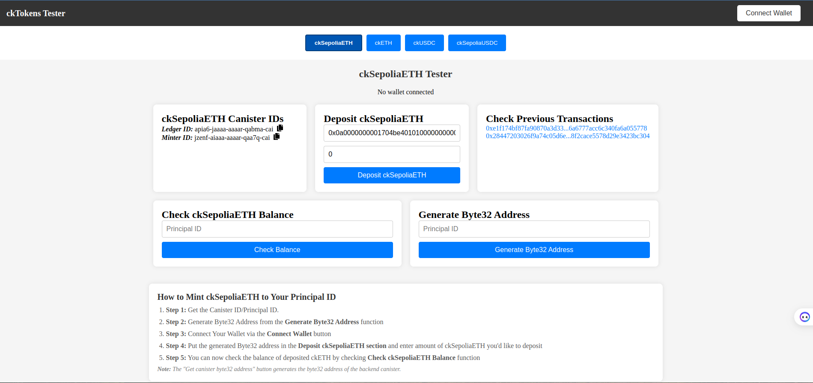

# Getting Started with ckETH: A Step-by-Step Guide

This tutorial will guide you through the process of working with ckETH, from generating a subaccount for ETH deposits to minting ckETH and verifying transactions on-chain. By the end of this tutorial, you will have a basic understanding of how to interact with the ckETH protocol using a Rust backend and a React frontend.

Slides on ckETH explanation can be found [here](https://www.canva.com/design/DAGNHEG_n-Y/Z8vo3oZsTnxMINLBlyizYw/edit)

## Testing the ckETH Minter: 
You can now easily mint ckSepoliaETH to your principal ID using this site - [Link](https://lqsjp-paaaa-aaaal-qjpsq-cai.icp0.io/) 



```bash
Here are the steps: 

Step 1: Get the Canister ID/Principal ID.
Step 2: Generate Byte32 Address from the Generate Byte32 Address function
Step 3: Connect Your Wallet via the Connect Wallet button
Step 4: Put the generated Byte32 address in the Deposit ckETH section and enter amount of ckETH youd like to deposit
Step 5: You can now check the balance of deposited ckETH by checking Check ckETH Balance function
Note: The "Get canister byte32 address" button generates the byte32 address of the backend canister.
```

## Prerequisites

Before we begin, ensure you have the following:

- You've installed [necessary environment requirements](https://internetcomputer.org/docs/current/developer-docs/getting-started/install/)
- [MetaMask installed in your browser](https://metamask.io/download/) with [Sepolia ETH (testnet) tokens](https://www.alchemy.com/faucets/ethereum-sepolia)
- Basic knowledge oF rust

## Install project template
I have created a simple template that comes with the configurations for calling the heloper smart contract on Ethereum, this allows you to only focus on the backend logic for intergrating ckETH

Here's the [link to the repo](https://github.com/Stephen-Kimoi/starter-template)


## Step 0(a): Setting Up the Project
Clone the project template from the link provided above. 

```bash
git clone https://github.com/Stephen-Kimoi/starter-template.git
```

```bash 
cd starter-template && npm install
```

Give permissions to the script
```bash 
chmod +x ./did.sh
```

Start the local replica for dfx 
```bash
dfx start --clean --background
```

Deploy the backend canister
```bash
./did.sh && dfx generate cketh_starter_backend && dfx deploy cketh_starter_backend
```

Start the frontend 
```bash 
npm run start 
```

## Step 0(b): Understanding the frontend logic

## 1. `depositAddress`

### Description
The `depositAddress` function is responsible for retrieving a unique deposit address from the backend canister on the Internet Computer. This address is where the user will send their Ethereum deposit.

### Usage
- **Purpose**: Fetches and sets the deposit address in the `canisterDepositAddress` state.
- **Called When**: The user clicks the "Get Deposit Address" button.

### Code Example
```javascript
const depositAddress = async () => {
  const depositAddress = await cketh_starter_backend.canister_deposit_principal();
  console.log("Deposit Address: ", depositAddress);
  setCanisterDepositAddress(depositAddress);
};
```

### Key Points
- **Async Operation**: The function is asynchronous, ensuring that the deposit address is retrieved properly before updating the state.
- **State Update**: After fetching the address, it updates the `canisterDepositAddress` state to make it available for subsequent transactions.

## 2. `write`

### Description
The `write` function interacts with the `MinterHelper` smart contract on Ethereum to execute the `deposit` method. This method sends the specified amount of Ethereum to the deposit address.

### Usage
- **Purpose**: Initiates a transaction to deposit Ethereum into the deposit address.
- **Called When**: The user clicks the "Deposit" button.

### Code Example
```javascript
const { write, data, isLoading: isWriteLoading } = useContractWrite({
  address: contractAddress,
  abi: abi,
  functionName: "deposit",
  value: parseEther(amount.toString()),
  args: [canisterDepositAddress],
  onSuccess(data) {
    toast.info("Sending ETH to the helper contract");
  },
  onError(error) {
    toast.error("Failed to send ETH");
    console.error(error);
  }
});
```

### Key Points
- **Parameters**: Sends the Ethereum amount and deposit address as arguments to the `deposit` function in the smart contract.
- **Notification**: Provides user feedback through toast notifications upon success or error.
- **Loading State**: Manages the loading state with `isWriteLoading` to disable inputs and buttons during the transaction.

## 3. `useWaitForTransaction`

### Description
The `useWaitForTransaction` hook monitors the status of the Ethereum transaction initiated by the `write` function. Once the transaction is confirmed, it triggers the `verifyTransaction` function.

### Usage
- **Purpose**: Waits for transaction confirmation and initiates verification.
- **Called When**: Automatically triggered after a transaction hash is generated.

### Code Example
```javascript
const { isLoading: isTxLoading } = useWaitForTransaction({
  hash: data?.hash,
  onSuccess() {
    toast.info("Verifying the transaction on-chain");
    verifyTransaction(data.hash);
  },
  onError(error) {
    toast.error("Transaction failed or rejected");
    console.error(error);
  }
});
```

### Key Points
- **Transaction Monitoring**: It checks the transaction status using its hash.
- **Verification Trigger**: On success, it calls the `verifyTransaction` function to validate the transaction on-chain.

## 4. `verifyTransaction`

### Description
The `verifyTransaction` function verifies a transaction on the Ethereum blockchain by interacting with the backend canister on the Internet Computer.

### Usage
- **Purpose**: Verifies the transaction using its hash and retrieves the result.
- **Called When**: 
  - Automatically after a transaction is confirmed.
  - Manually when the user inputs a transaction hash and clicks the "Verify Transaction" button.

### Code Example
```javascript
const verifyTransaction = async (hash) => {
  setIsVerifying(true); // Start loading
  setVerificationError(null); // Reset error state

  try {
    const result = await cketh_starter_backend.verify_transaction(hash);
    setVerificationResult(result); // Store the verification result
    toast.success("Transaction verified successfully");
  } catch (error) {
    setVerificationError("Verification failed. Please check the transaction hash and try again.");
    toast.error("Verification failed");
    console.error(error);
  } finally {
    setIsVerifying(false); // Stop loading
  }
};
```

### Key Points
- **Transaction Hash**: Takes the transaction hash as an argument.
- **Async Operation**: This function is asynchronous and updates the UI based on success or failure.
- **Error Handling**: Catches errors during the verification process and displays appropriate messages.
- **State Management**: Updates `isVerifying`, `verificationResult`, and `verificationError` states to reflect the current status of the verification process.

## 5. `changeAmountHandler`

### Description
The `changeAmountHandler` function manages changes to the deposit amount input field, ensuring that only valid numerical values are accepted.

### Usage
- **Purpose**: Updates the `amount` state based on user input.
- **Called When**: The user types in the "Amount" input field.

### Code Example
```javascript
const changeAmountHandler = (e) => {
  let amount = e.target.valueAsNumber;
  if (Number.isNaN(amount) || amount < 0) amount = 0;
  setAmount(amount);
};
```

### Key Points
- **Input Validation**: Ensures that the input is a positive number or resets it to zero.
- **State Update**: Directly updates the `amount` state based on user input.

## 6. `changeAddressHandler`

### Description
The `changeAddressHandler` function handles changes to the deposit address input field.

### Usage
- **Purpose**: Updates the `canisterDepositAddress` state with the user's input.
- **Called When**: The user types in the "Canister Deposit Address" input field.

### Code Example
```javascript
const changeAddressHandler = (e) => {
  setCanisterDepositAddress(e.target.value);
};
```

### Key Points
- **State Update**: Directly updates the `canisterDepositAddress` state with the new input value.

## 7. `changeTransactionHashHandler`

### Description
The `changeTransactionHashHandler` function manages changes to the transaction hash input field.

### Usage
- **Purpose**: Updates the `transactionHash` state with the user-provided hash.
- **Called When**: The user types in the "Transaction Hash" input field.

### Code Example
```javascript
const changeTransactionHashHandler = (e) => {
  setTransactionHash(e.target.value);
};
```

### Key Points
- **State Update**: Directly updates the `transactionHash` state with the new hash value.

## Step 1: Generating a Subaccount from a Principal ID

The first step is to create a function that converts a Principal ID into a subaccount. This subaccount is necessary for depositing ETH.

### Backend Code
First of all you need to add the follwing dependency to your ``Cargo.toml`` file inside the backend directory 
```toml
b3_utils = { version = "0.11.0", features = ["ledger"] }
```

Then you can insert the rust function to your ``lib.rs`` file 

```rust
use b3_utils::{vec_to_hex_string_with_0x, Subaccount};

#[ic_cdk::query]
fn canister_deposit_principal() -> String {
    let subaccount = Subaccount::from(ic_cdk::id());

    let bytes32 = subaccount.to_bytes32().unwrap();

    vec_to_hex_string_with_0x(bytes32)
}
```

This function generates a deposit address that you can use to mint ckETH to the new subaccount.

You can now test the function by calling the ``Get Deposit Address`` button on your frontend

## Step 2: Minting ckETH Tokens

Once you have the deposit principal, the next step is to mint ckETH tokens by calling the `deposit` function in the ckETH helper contract with the generated address as the argument.

### Contract Information

Inside the `_components/contracts` directory, you will find:

- The contract address of the minter helper located at `contract-address.json`.
- The ABI of the minter helper located at `MinterHelper.json`.

### Frontend Code

Here's how to integrate the deposit function in your frontend:

```javascript
import { useAccount, useContractWrite } from 'wagmi';
import { parseEther } from 'viem';
import { MinterHelper as contractAddress } from '../contracts/contracts-address.json';
import abi from '../contracts/MinterHelper.json';
import { toast } from 'react-toastify';

function Header() {
  const { address, isConnected } = useAccount();
  const [amount, setAmount] = useState(0);
  const [canisterDepositAddress, setCanisterDepositAddress] = useState("");

  const depositAddress = async () => {
    const depositAddress = await cketh_tutorial_backend.canister_deposit_principal();
    setCanisterDepositAddress(depositAddress);
  };

  const { write, data, isLoading: isWriteLoading } = useContractWrite({
    address: contractAddress,
    abi: abi,
    functionName: "deposit",
    value: parseEther(amount.toString()),
    args: [canisterDepositAddress],
    onSuccess(data) {
      toast.info("Sending ETH to the helper contract");
    },
    onError(error) {
      toast.error("Failed to send ETH");
      console.error(error);
    }
  });

  return (
    // Your JSX code for rendering the UI
  );
}
```

This code snippet allows users to connect their MetaMask wallet, input an amount, and click the "Deposit" button to mint ckETH to the generated principal address.

## Step 3: Verifying the Transaction On-Chain

After minting ckETH, it's crucial to verify the transaction on-chain. This involves checking several details:

- The transaction status should be `1` (indicating success).
- The `to` address must match the minter address.
- The logs must include the correct deposit principal.

### Backend Code
Install the following packages in your ``cargo.toml`` file by copy pasting the follwing content: 
```toml 
serde = { version = "1", features = ["derive"] }
serde_json = "1.0"
```

Copy the contents from the ``recept.rs`` file and paste them into a similar file on your directory 

Then import the module in your ``lib.rs`` file like this: 
```rust 
mod receipt;
```

We then need to install the ``ic-evm-utils`` and ``evm-rpc-canister-types`` packages that allow us to interact with the EVM_RPC Canister 

```toml 
ic-evm-utils = "1.0.0"
evm-rpc-canister-types = "1.0.0" 
```

Then add the ``evm_rpc`` canister to your ``dfx.json`` file: 

```json 
"evm_rpc": {
      "type": "custom",
      "candid": "https://github.com/internet-computer-protocol/evm-rpc-canister/releases/latest/download/evm_rpc.did",
      "wasm": "https://github.com/internet-computer-protocol/evm-rpc-canister/releases/latest/download/evm_rpc.wasm.gz",
      "remote": {
      "id": {
        "ic": "7hfb6-caaaa-aaaar-qadga-cai"
      }
      },
      "specified_id": "7hfb6-caaaa-aaaar-qadga-cai",
      "init_arg": "(record { nodesInSubnet = 28 })"
    },
```

Import the required dependencies in your ``lib.rs`` file and instantiate your ``EVM_RPC`` canister:

```rust 
// Import required types
use evm_rpc_canister_types::{
    EthSepoliaService, EvmRpcCanister, GetTransactionReceiptResult, MultiGetTransactionReceiptResult, RpcServices
};
use candid::{Nat, Principal};

// Initialize the canister
pub const EVM_RPC_CANISTER_ID: Principal =
  Principal::from_slice(b"\x00\x00\x00\x00\x02\x30\x00\xCC\x01\x01"); // 7hfb6-caaaa-aaaar-qadga-cai
pub const EVM_RPC: EvmRpcCanister = EvmRpcCanister(EVM_RPC_CANISTER_ID);

// Define the Minter address for ckSepoliaETH
const MINTER_ADDRESS: &str = "0xb44b5e756a894775fc32eddf3314bb1b1944dc34"; 

// Convert `GetTransactionReceiptResult` to`ReceiptWrapper`,for proper handling of the response 
impl From<GetTransactionReceiptResult> for receipt::ReceiptWrapper {
    fn from(result: GetTransactionReceiptResult) -> Self {
        match result {
            GetTransactionReceiptResult::Ok(receipt) => {
                if let Some(receipt) = receipt {
                    receipt::ReceiptWrapper::Ok(receipt::TransactionReceiptData {
                        to: receipt.to,
                        status: receipt.status.to_string(),
                        transaction_hash: receipt.transactionHash,
                        block_number: receipt.blockNumber.to_string(),
                        from: receipt.from,
                        logs: receipt.logs.into_iter().map(|log| receipt::LogEntry {
                            address: log.address,
                            topics: log.topics,
                        }).collect(),
                    })
                } else {
                    receipt::ReceiptWrapper::Err("Receipt is None".to_string())
                }
            },
            GetTransactionReceiptResult::Err(e) => receipt::ReceiptWrapper::Err(format!("Error on Get transaction receipt result: {:?}", e)),
        }
    }
} 
```

Create a new function  called ``eth_get_transaction_receipt``that is responsible for getting the transaction receipt the transaction hash

```rust
async fn eth_get_transaction_receipt(hash: String) -> Result<GetTransactionReceiptResult, String> {
    // Make the call to the EVM_RPC canister
    let result: Result<(MultiGetTransactionReceiptResult,), String> = EVM_RPC 
        .eth_get_transaction_receipt(
            RpcServices::EthSepolia(Some(vec![
                EthSepoliaService::PublicNode,
                EthSepoliaService::BlockPi,
                EthSepoliaService::Ankr,
            ])),
            None, 
            hash, 
            10_000_000_000
        )
        .await 
        .map_err(|e| format!("Failed to call eth_getTransactionReceipt: {:?}", e));

    match result {
        Ok((MultiGetTransactionReceiptResult::Consistent(receipt),)) => {
            Ok(receipt)
        },
        Ok((MultiGetTransactionReceiptResult::Inconsistent(error),)) => {
            Err(format!("EVM_RPC returned inconsistent results: {:?}", error))
        },
        Err(e) => Err(format!("Error calling EVM_RPC: {}", e)),
    }    
}
```
 
Now, create a function to verify the transaction:

```rust
#[ic_cdk::update]
async fn verify_transaction(hash: String) -> Result<receipt::VerifiedTransactionDetails, String> {
    let receipt = match eth_get_transaction_receipt(hash.clone()).await {
        Ok(receipt) => receipt,
        Err(e) => return Err(format!("Failed to get receipt: {}", e)),
    };

    let receipt_data = match receipt {
        GetTransactionReceiptResult::Ok(Some(data)) => data,
        GetTransactionReceiptResult::Ok(None) => return Err("Receipt is None".to_string()),
        GetTransactionReceiptResult::Err(e) => return Err(format!("Error on Get transaction receipt result: {:?}", e)),
    };

    let success_status = Nat::from(1u8);
    if receipt_data.status != success_status {
        return Err("Transaction failed".to_string());
    }

    if receipt_data.to != MINTER_ADDRESS {
        return Err("Minter address does not match".to_string());
    }

    Ok(receipt::VerifiedTransactionDetails {
        to: receipt_data.to.clone(),
        status: receipt_data.status.to_string(),
        transaction_hash: receipt_data.transactionHash.clone(),
        block_number: receipt_data.blockNumber.to_string(),
        from: receipt_data.from.clone(),
        logs: receipt_data.logs.into_iter().map(|log| receipt::LogEntry {
            address: log.address,
            topics: log.topics,
        }).collect(),
    })
}
```

When you're done with that you can redeploy all the canisters (including evm_rpc canister) locally by running the command 

```bash 
./did.sh && dfx generate cketh_starter_backend && dfx deploy evm_rpc && dfx deploy cketh_starter_backend
```
You can now call the button ``deposit`` on your frontend section to mint ckETH tokens to your backend principal ID

### Frontend Code for Verification

Add a section in your frontend to input a transaction hash and verify it:

```javascript
function Header() {
  // Other states and functions...

  const [transactionHash, setTransactionHash] = useState("");
  const [verificationResult, setVerificationResult] = useState(null);
  const [isVerifying, setIsVerifying] = useState(false);
  const [verificationError, setVerificationError] = useState(null);

  const verifyTransaction = async (hash) => {
    setIsVerifying(true);
    setVerificationError(null);

    try {
      const result = await cketh_tutorial_backend.verify_transaction(hash);
      setVerificationResult(result);
      toast.success("Transaction verified successfully");
    } catch (error) {
      setVerificationError("Verification failed. Please check the transaction hash and try again.");
      toast.error("Verification failed");
      console.error(error);
    } finally {
      setIsVerifying(false);
    }
  };

  return (
    // Your JSX code for rendering the UI
  );
}
```

This allows users to verify the transaction by inputting the transaction hash.

## Step 4: Fetching canister's ckETH balance and performing transfer functionalities

Import the following structs from the ``b3_utils::ledger`` and ``b3_utils::api`` dependencies:
```rust 
use b3_utils::ledger::{ICRCAccount, ICRC1, ICRC1TransferArgs, ICRC1TransferResult};
use b3_utils::api::{InterCall, CallCycles}; 
```
Now define the ``LEDGER`` canister ID that is responsible for the withdrawal and transfer of ckETH and the ``MINTER`` canister ID that is responsible for minting and burning of ckETH tokens

```rust 
const LEDGER: &str = "apia6-jaaaa-aaaar-qabma-cai";
const MINTER: &str = "jzenf-aiaaa-aaaar-qaa7q-cai";
```

Copy the following content and add them to a mod file, name the file ``minter.rs``: 
```rust 
use candid::{CandidType, Deserialize, Nat};

#[derive(CandidType, Deserialize)]
pub struct WithdrawalArg {
    pub amount: Nat,
    pub recipient: String,
}

#[derive(CandidType, Deserialize, Clone, Debug)]
pub struct RetrieveEthRequest {
    pub block_index: Nat,
}

#[derive(CandidType, Deserialize, Debug)]
pub enum WithdrawalError {
    AmountTooLow { min_withdrawal_amount: Nat },
    InsufficientFunds { balance: Nat },
    InsufficientAllowance { allowance: Nat },
    TemporarilyUnavailable(String),
}

pub type WithdrawalResult = Result<RetrieveEthRequest, WithdrawalError>;
```

Ensure you've imported the mod on your ``lib.rs`` file: 
```rust
mod minter;
```

To ensure that only authorized accounts call the withdraw functionality, ensure you've imported the function ``caller_is_controller`` from ``b3_utils``: 
```rust 
use b3_utils::caller_is_controller;
```

Now add the following functions to your ``lib.rs``: 
```rust
// Fetching canister's balance of ckETH
#[ic_cdk::update]
async fn balance() -> Nat {
    let account = ICRCAccount::new(ic_cdk::id(), None);

    ICRC1::from(LEDGER).balance_of(account).await.unwrap()
}

// Transfering a specified amount of ckETH to another account 
#[ic_cdk::update]
async fn transfer(to: String, amount: Nat) -> ICRC1TransferResult {
    let to = ICRCAccount::from_str(&to).unwrap(); 
    
    let transfer_args = ICRC1TransferArgs {
        to, 
        amount, 
        from_subaccount: None, 
        fee: None, 
        memo: None, 
        created_at_time: None, 
    }; 

    ICRC1::from(LEDGER).transfer(transfer_args).await.unwrap()
}

// Withdrawing ckETH from the canister
#[ic_cdk::update(guard = "caller_is_controller")]
async fn withdraw(amount: Nat, recipient: String) -> minter::WithdrawalResult {
    let withdraw = minter::WithdrawalArg{ 
        amount, 
        recipient
    }; 
    
    InterCall::from(MINTER)
    .call(
        "withdraw_eth", 
        withdraw, 
        CallCycles::NoPay
    )
    .await
    .unwrap()
}
```

## Future Updates

We are continuously working on improving this project. Here are some exciting updates to look forward to:

1. **Plugin Development**: We are in the process of converting this template into a plugin. This will make it even easier to integrate ckETH functionality into your existing projects.

2. **Additional Features**: We plan to add more features to enhance the functionality of the ckETH integration. These may include:
    - Advanced transaction monitoring
    - Enhanced error handling and recovery mechanisms
    - Integration with additional Ethereum networks
    - Improved user interface for better transaction management

3. **Documentation and Tutorials**: We will be expanding our documentation and creating more in-depth tutorials to cover advanced use cases and best practices.

4. **Community Contributions**: We encourage community involvement and will be setting up contribution guidelines for those who want to help improve and expand this project.

Stay tuned for these updates, and feel free to star and watch the repository for the latest developments!


## Conclusion

You have now successfully created a ckETH integration with Rust and React, including depositing ETH, minting ckETH, and verifying the transaction on-chain. This tutorial provides a solid foundation for working with ckETH and can be expanded to include more features as needed.
